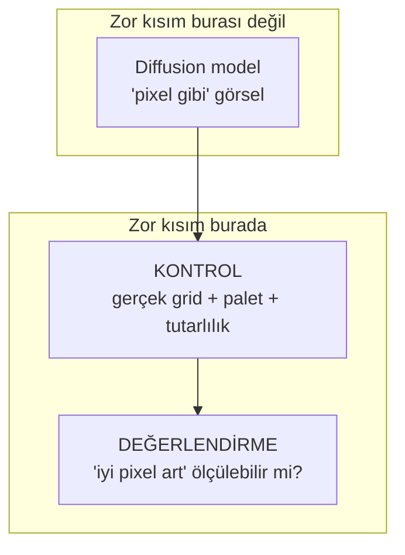

# 01 — Genel Bakış

## Sistem ne yapar?

Metin bir prompt'tan (`"a brave knight sprite"`) **gerçek pixel art asset** üretir:
küçük, sınırlı paletli, grid'e hizalı, oyunda kullanılabilir bir PNG.

## Ana içgörü

Diffusion modeli (SDXL + pixel-art LoRA) "pixel **gibi görünen**" ama teknik olarak
pixel **olmayan** bir görsel üretir — bulanık kenarlı, yüzlerce renkli. Sistemin değeri
modelde değil, iki şeyde:

- **Kontrol** → `postprocess`: ham görseli gerçek pixel art'a çevirir.
- **Değerlendirme** → `eval`: kaliteyi sayıya döker; regresyonu yakalar, deneyleri kıyaslar.

Bu ikisi bir *demo*'yu bir *ML sistemi*nden ayıran şeydir.

## Tasarım ilkeleri

| İlke | Neden | Nerede görünür |
|------|-------|----------------|
| **Ağır/hafif ayrımı** | postprocess+eval GPU'suz test edilebilsin | `[ml]` extra opsiyonel |
| **Tipli kontratlar** | bir modülü değiştirmek diğerini kırmasın | `GenerationRequest/Result` |
| **Ölç, tahmin etme** | "8 kol tutmuyor" gibi sorunlar sayısallaşsın | `eval` metrikleri |
| **Sert pin izolasyonu** | torchao/peft cehennemi tekrar etmesin | pin'ler sadece `[ml]`'de |
| **İnce notebook** | repo notebook çöplüğüne dönmesin | mantık `src/`'de |

## Hedef bağlam

- **Amaç:** kişisel/portfolyo — serving basit (CLI/Gradio), production queue yok.
- **Compute:** sadece Colab — LoRA fine-tune buna göre planlanır (önce SD1.5).
- **Yön:** önce **statik** asset, sonra **animasyon**.
