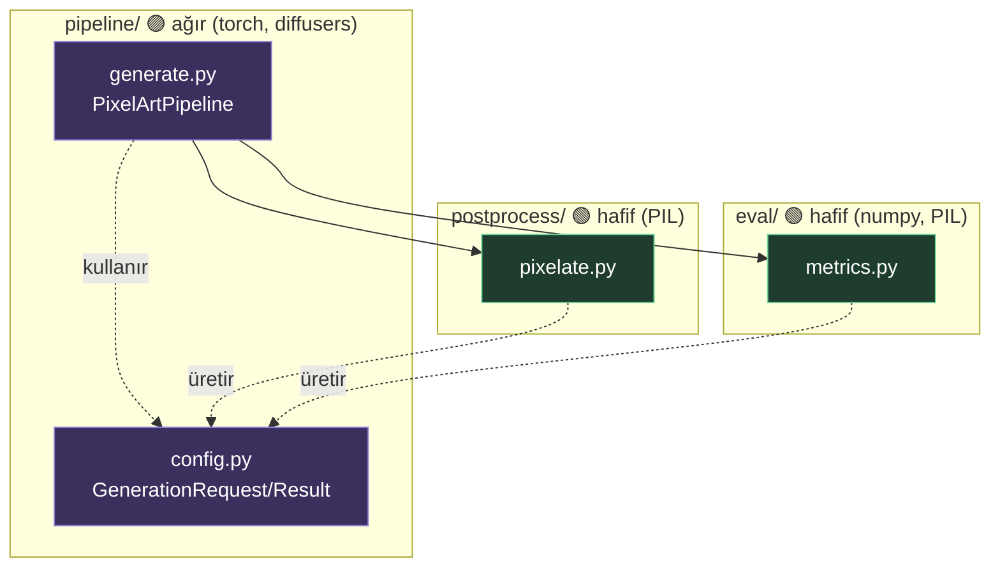
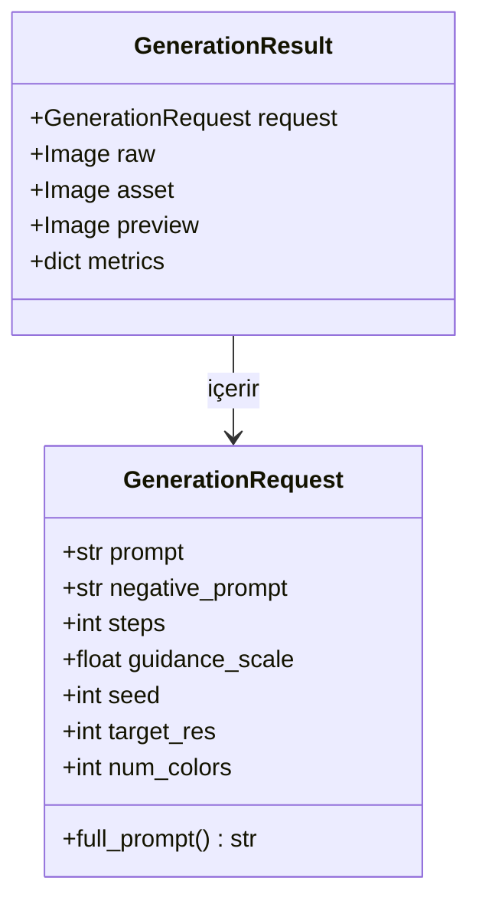

# 02 — Mimari

## Katmanlar ve bağımlılık yönü

Bağımlılık **tek yönlüdür**. `pipeline` üsttedir, aşağıdakileri çağırır; alt katmanlar
asla yukarı bakmaz. Bu, `postprocess` ve `eval`'i torch'suz ve bağımsız test edilebilir tutar.



**Kural:** `postprocess` ve `eval` **asla `torch` import etmez.** Bu sınır bozulursa
yerel testler (GPU'suz) çöker — CI bunu yakalar.

## Modül sorumlulukları

| Modül | Girdi | Çıktı | Bağımlılık |
|-------|-------|-------|------------|
| `pipeline/config` | — | tip tanımları | pydantic |
| `pipeline/generate` | `GenerationRequest` | `GenerationResult` | torch, diffusers `[ml]` |
| `postprocess/pixelate` | ham `Image` | `(asset, preview)` | PIL |
| `eval/metrics` | asset `Image` | `dict[str,float]` | numpy, PIL |

## Kontrat: sistemin bel kemiği

Her şey iki tip üzerinden akar (`pipeline/config.py`):



`GenerationRequest` serileştirilebilir → config/queue/log'a yazılabilir, reprodüksiyon
için seed'le birlikte saklanır. Bir agent yeni bir parametre eklerken **buradan başlar**,
sonra tüm çağıranları günceller.

## Fiziksel yerleşim

```
src/pixelforge/
├── __init__.py          # torch'suz güvenli import yüzeyi
├── pipeline/
│   ├── config.py        # KONTRATLAR (hafif)
│   ├── generate.py      # inference (ağır, lazy torch)
│   └── __init__.py      # PixelArtPipeline lazy-export
├── postprocess/
│   └── pixelate.py
└── eval/
    └── metrics.py
```

`pipeline/__init__.py`, `PixelArtPipeline`'ı **lazy** export eder (`__getattr__` ile):
`import pixelforge` torch olmadan çökmez; torch ancak gerçekten üretim yapınca yüklenir.
