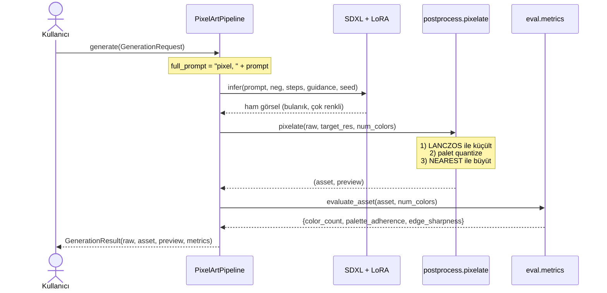
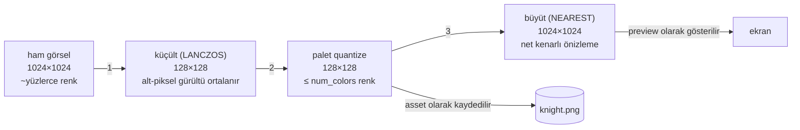
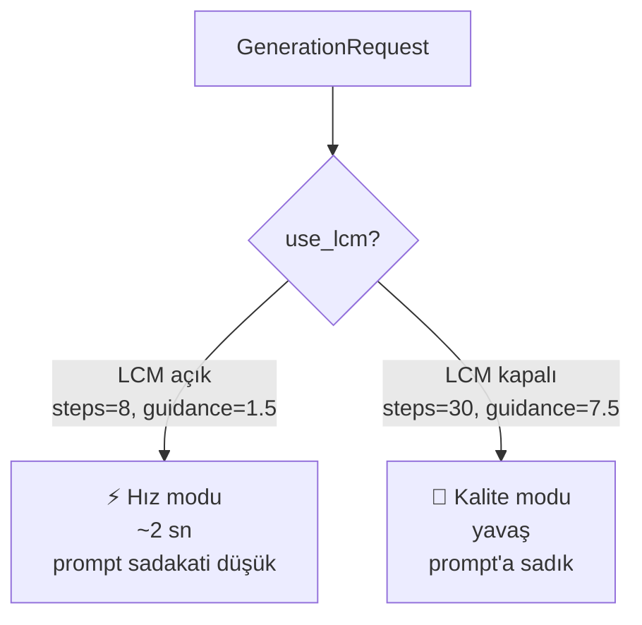

# 03 — Veri Akışı

## Bir prompt'un asset'e yolculuğu

## Üç aşamalı dönüşüm (postprocess'in kalbi)

- **asset** = küçük, temiz — oyunda kullanılacak gerçek dosya.
- **preview** = büyütülmüş hali — sadece göz kontrolü için.

## Hız vs. sadakat: iki mod

Aynı akış, iki farklı ayarla çalışır:

"8 kol / 4 göz tutmuyor" sorunu → **kalite modu** + tanımlayıcı prompt ile iyileşir
(ama kesin sayı hiçbir modda garanti değil; diffusion'ın doğal sınırı).
