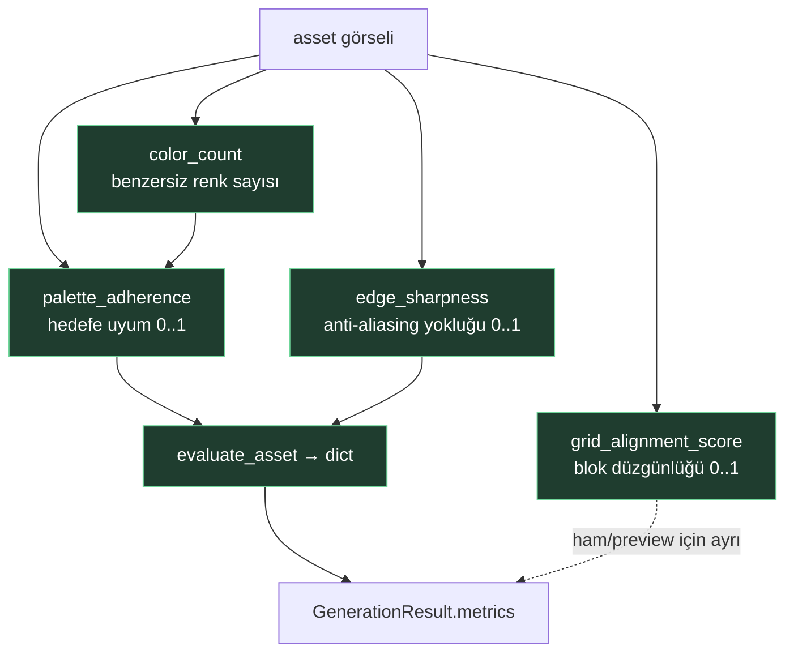
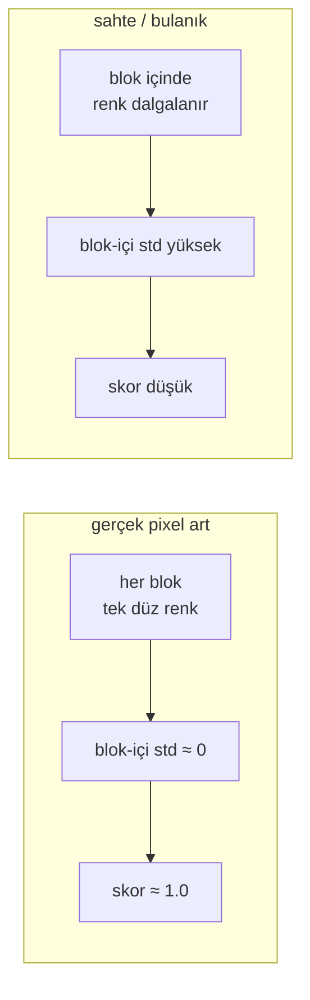
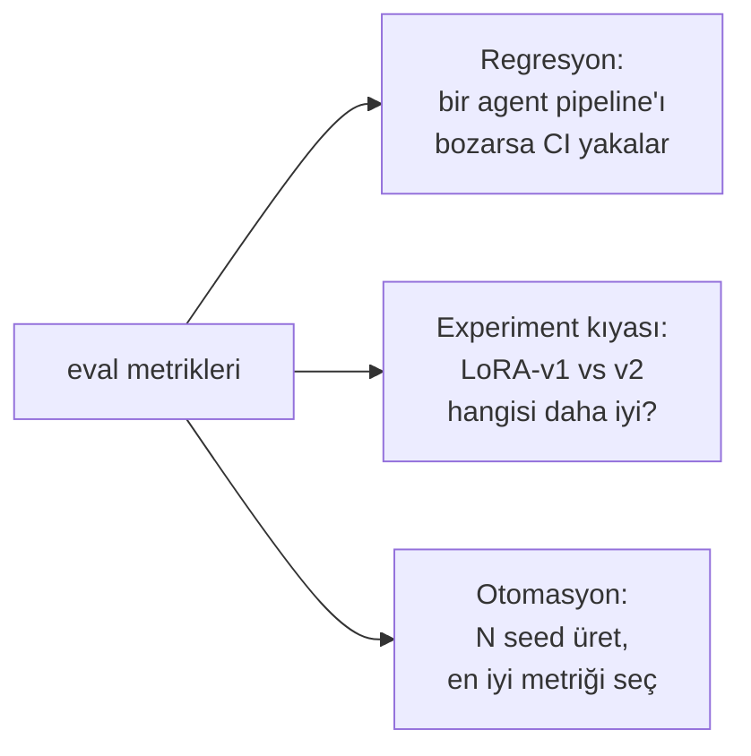

# 04 — Değerlendirme (ML Çekirdeği)

Bir demo ile bir ML sistemi arasındaki fark: **kaliteyi ölçebilmek.** Ground-truth
gerektirmeyen, deterministik, GPU'suz metrikler (`eval/metrics.py`).

## Metrik haritası

## Her metrik neyi yakalar?

| Metrik | Ölçtüğü | "İyi" | Yakaladığı hata |
|--------|---------|-------|-----------------|
| `color_count` | benzersiz RGB sayısı | ham sayı | — (girdi) |
| `palette_adherence` | renk hedefe uyuyor mu | 1.0 | çok renkli = "sahte" pixel art |
| `grid_alignment_score` | NxN bloklara ayrışıyor mu | ~1.0 | bulanık, grid-dışı görsel |
| `edge_sharpness` | kenarlar keskin mi | →1.0 | anti-aliasing halkaları |

## grid_alignment nasıl çalışır?

Görüntüyü `block_size × block_size` bloklara böler, her bloğun renk **std**'sini ölçer.
Gerçek pixel art'ta bloklar düz → std ~0 → skor ~1. Formül: `1 − ortalama_std / 128`.

## Neden bu, projenin merkezi?

## Sırada ne var (Faz 1)

- **CLIP prompt-sadakati** metriği (torch ister → ayrı modül, lazy). "Prompt'a ne kadar
  uyuyor" sorusunu sayısallaştırır — "8 kol tutmuyor"un ölçülebilir hali.
- **Tileability** (tileset kenar sürekliliği) ve **transparency** (temiz alpha) metrikleri.
