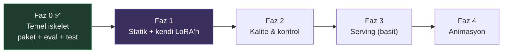
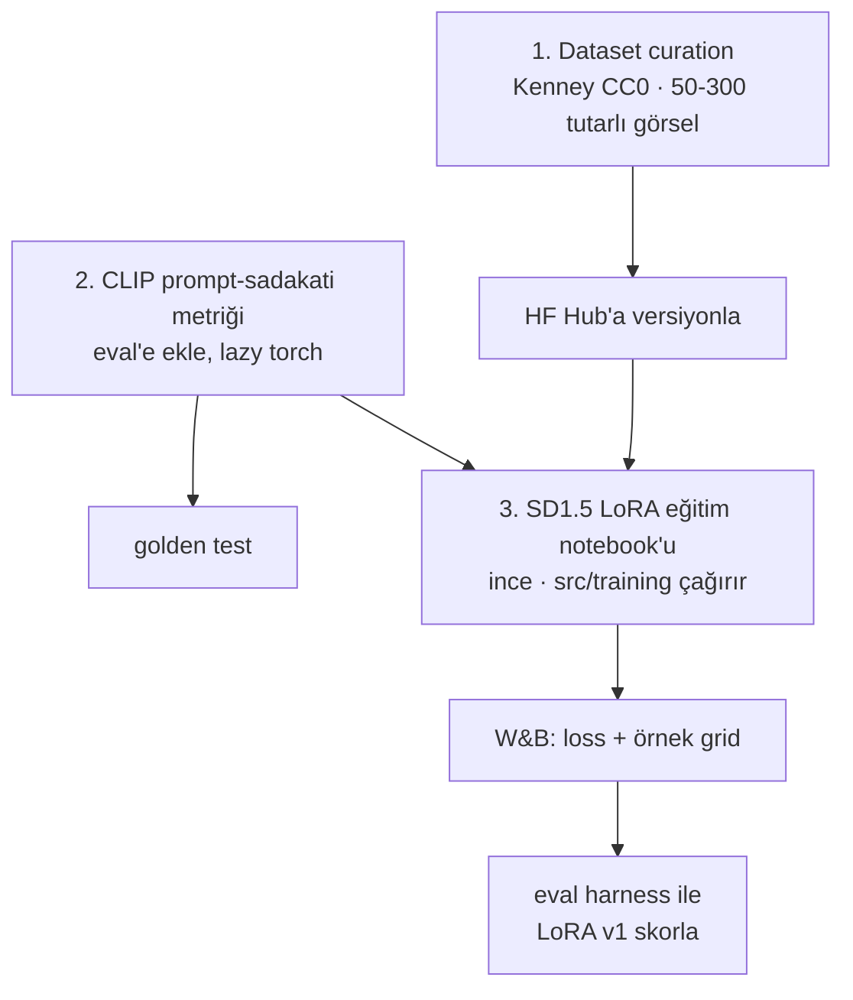
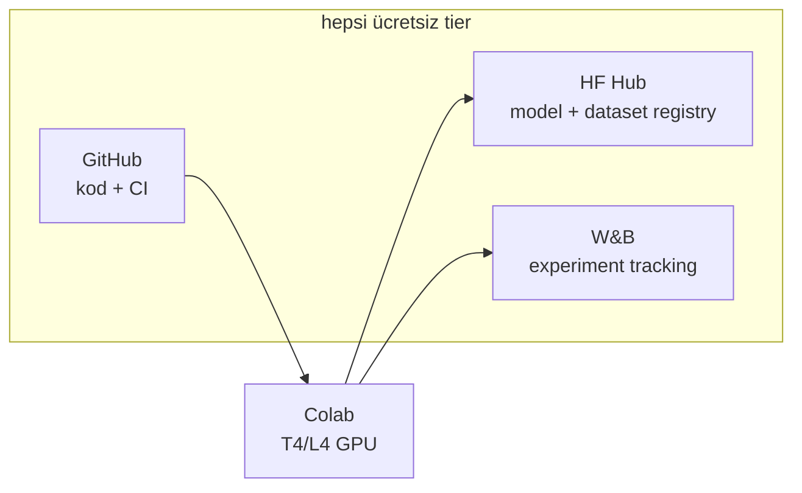

# 05 — Yol Haritası

## Fazlar

## Faz detayları

| Faz | Amaç | Ana işler | Durum |
|-----|------|-----------|-------|
| **0** | demo → sistem | paket, kontrat, postprocess, eval, test, CI-hazır | ✅ tamam |
| **1** | statik + LoRA | dataset (Kenney/CC0) → HF Hub · CLIP metriği · ilk SD1.5 LoRA eğitimi · W&B takibi | ▶ sırada |
| **2** | kalite & kontrol | transparency/bg-removal · sprite set tutarlılığı · SDXL'e yükseltme · ControlNet (poz) | |
| **3** | serving | Gradio app + CLI · model registry (HF Hub) · basit maliyet/latency izleme | |
| **4** | animasyon | keyframe + interpolasyon · sprite sheet üretimi · temporal tutarlılık | |

## Faz 1 — yakın plan

**Neden SD1.5 önce?** T4'te ~1-2 saatte, hızlı iterasyonla eğitilir; training pipeline'ını
ve eval'i öğrenmek için ideal. Sağlamlaşınca SDXL LoRA'ya yükseltilir.

## MLOps katmanları (ücretsiz yığın)

## "Repo patlamasın" guardrail'leri (her fazda geçerli)

- Ağırlık/dataset/çıktı **git'e girmez** → HF Hub.
- Yeni ML deps **sert pinli**; çekirdek floor.
- Her yeni davranış **test'li**; `eval` metrikleri regresyon kapısı.
- Notebook **ince**; mantık `src/`'de.
- Modüller arası **tipli kontrat**; sınırlar `CLAUDE.md`'de.
