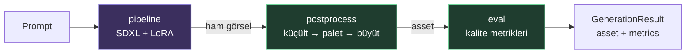

# pixelforge — Sistem Dokümantasyonu

Bu klasör sistemi **kavramsal** olarak anlatır: ne, neden, nasıl akıyor.
Kod ayrıntısı değil, mimari resim. Kod değiştikçe burası da güncellenmeli.

## İçindekiler

| Dosya | Konu |
|-------|------|
| [01-overview.md](01-overview.md) | Sistem ne yapar, ana fikir, tasarım ilkeleri |
| [02-architecture.md](02-architecture.md) | Katmanlar, bağımlılık yönü, modül sınırları |
| [03-data-flow.md](03-data-flow.md) | Bir prompt'un asset'e dönüşme yolculuğu (sequence) |
| [04-evaluation.md](04-evaluation.md) | "İyi pixel art" nasıl ölçülür — metrikler |
| [05-roadmap.md](05-roadmap.md) | Statik → animasyon fazları, MLOps yol haritası |

## Bir bakışta

> 🟣 Ağır (torch/diffusers, sadece Colab/GPU) &nbsp;&nbsp; 🟢 Hafif (PIL/numpy, her yerde)
